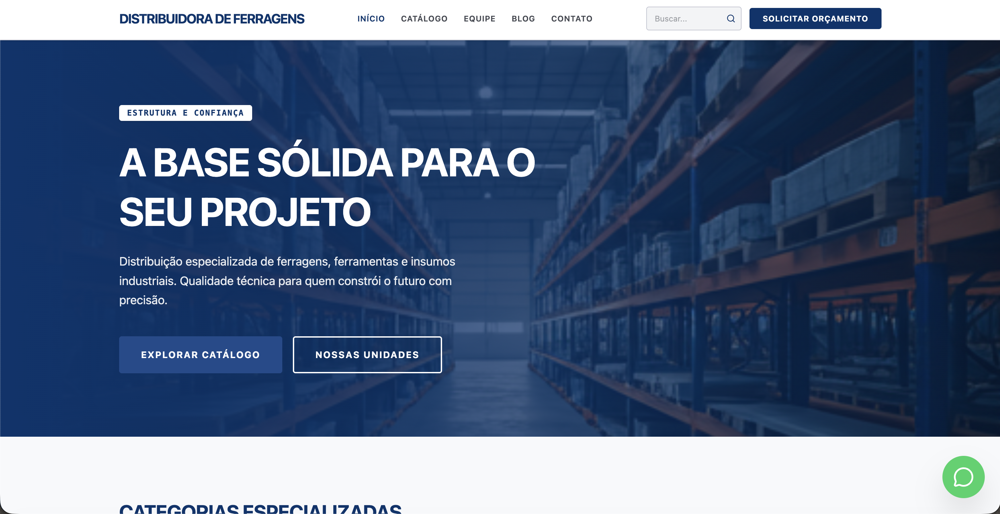

<div align="center">

</div>

# Site Distribuidora de Ferragens

Plataforma desenvolvida sob medida para a **Distribuidora de Ferragens**, contando com um catálogo de produtos robusto, gestão de conteúdo e um design focado em alta conversão no setor industrial e de atacado.

## 🚀 Tecnologias Utilizadas

Este projeto foi construído com ferramentas modernas para garantir alta performance e escalabilidade:

- **Frontend:** React, TypeScript, Vite
- **Backend / CMS:** Strapi (Node.js)
- **Infraestrutura:** Docker & Docker Compose
- **Integração:** Botão Flutuante do WhatsApp para orçamentos rápidos

## 🛠️ Como rodar o projeto localmente

**Pré-requisitos:** Node.js (v18+) e Docker (opcional, para o banco de dados).

### 1. Clonando o repositório
```bash
git clone https://github.com/joaoleonidasizidorio/site_distribuidora_ferragens.git
cd site_distribuidora_ferragens
```

### 2. Rodando o Frontend (Interface)
O frontend está localizado na raiz do projeto.
```bash
npm install
npm run dev
```
Acesse em: `http://localhost:3000` ou `http://localhost:5173`

### 3. Rodando o Backend (Strapi)
O servidor e banco de dados estão na pasta `server`.
```bash
cd server
npm install
npm run develop
```
O painel administrativo do CMS ficará disponível em `http://localhost:1337/admin`

## 📦 Deploy
Este projeto contém arquivos `Dockerfile` e `docker-compose.yml` para facilitar a publicação em servidores na nuvem (AWS, DigitalOcean, VPS).

---
*Desenvolvido por João Leônidas*
